# 🛒 Ecommerce Frontend


A React-based frontend for the **Ecommerce** platform, built with **React**, **Redux Toolkit**, **Vite**, **Tailwind CSS**, and **Material UI**.

The application provides a complete e-commerce experience, including product browsing, search and filtering, cart management, secure authentication, Stripe checkout, and order management. It also includes dedicated dashboards for sellers and administrators to manage products, categories, sellers, and orders.

The frontend communicates with the Spring Boot backend through REST APIs and follows a component-based architecture with reusable UI components, centralized state management, and role-based routing.

> **Backend Repository:** [Ecommerce Backend API](https://github.com/Dhanno98/Ecommerce-Backend)

## Quick Navigation

- [Overview](#overview)
- [Features](#features)
- [Tech Stack](#tech-stack)
- [Application Architecture](#application-architecture)
- [Project Structure](#project-structure)
- [Routing](#routing)
- [State Management (Redux)](#state-management-redux)
- [Authentication & Authorization](#authentication--authorization-1)
- [Application Flow](#application-flow)
- [Backend Integration](#backend-integration)
- [Stripe Integration](#stripe-integration)
- [UI Components](#ui-components)
- [Installation](#installation)
- [Configuration](#configuration)
- [Running the Application](#running-the-application)
- [Screenshots](#screenshots)
- [Contributing](#contributing)
- [License](#license)
- [Acknowledgements](#acknowledgements)

## Overview

Ecommerce Frontend is the client application for the Ecommerce platform. It consumes the REST APIs exposed by the Spring Boot backend and provides separate user experiences for customers, sellers, and administrators.

The application is organized around reusable React components, feature-based modules, and centralized state management using Redux Toolkit. Client-side routing is handled with React Router, while Tailwind CSS and Material UI are used together to build a responsive and consistent user interface.

The project is structured to keep business logic, API interactions, state management, and presentation components separated, making the codebase easier to maintain and extend as new features are added.

## Features

### Customer Experience

- Browse products with a responsive product catalog.
- Search and filter products using URL-based query parameters.
- View detailed product information in a modal without leaving the current page.
- Add products to the shopping cart with real-time cart updates.
- Manage cart quantities and proceed through the checkout flow.
- Complete payments securely using Stripe Checkout.
- View previous orders from a dedicated user dashboard.

### Authentication & Authorization

- User registration and login.
- Persistent authentication using JWT-based backend APIs.
- Protected routes for authenticated users.
- Automatic route protection and redirection based on authentication status and user role.
- Role-based access control for Customers, Sellers, and Administrators.

### Seller Dashboard

- View seller orders.
- Manage seller products.
- Access only the dashboard features permitted for seller accounts.

### Administrator Dashboard

- Dashboard overview.
- Manage products.
- Manage categories.
- Manage sellers.
- View and manage customer orders.

### User Interface

- Fully responsive layout for desktop and mobile devices.
- Reusable component-based architecture.
- Loading indicators and skeleton screens for asynchronous operations.
- Toast notifications for user feedback.
- Pagination for large datasets.
- Modern UI built with Tailwind CSS, Material UI, and Headless UI.

## Tech Stack

| Category | Technology | Usage |
|----------|------------|-------|
| **Language** | JavaScript (ES6+) | Primary programming language |
| **Frontend Framework** | React 19 | Building reusable and interactive user interfaces |
| **Build Tool** | Vite 7 | Development server and production build tooling |
| **State Management** | Redux Toolkit, React Redux | Centralized application state management |
| **Routing** | React Router 7 | Client-side routing and protected routes |
| **HTTP Client** | Axios | Communication with the backend REST APIs |
| **Styling** | Tailwind CSS 4 | Utility-first responsive styling |
| **Component Library** | Material UI 7 | Pre-built UI components and layouts |
| **Accessible UI Components** | Headless UI | Accessible, unstyled UI components |
| **Forms** | React Hook Form | Form state management and validation |
| **Payments** | Stripe Checkout | Secure online payment processing |
| **Tables** | MUI Data Grid | Administrative data tables and grids |
| **Notifications** | React Hot Toast | User feedback and application notifications |
| **Icons** | React Icons | Consistent icon library throughout the application |

## Application Architecture

The Ecommerce Frontend follows a component-based architecture that separates presentation, routing, state management, API communication, and reusable UI elements into dedicated modules. React components are responsible for rendering the user interface, while React Router manages navigation between public, protected, seller, and administrator routes.

Application state is centralized using Redux Toolkit, allowing different parts of the application to share data consistently without excessive prop drilling. API communication is handled through Axios-based service modules that interact with the Spring Boot backend. UI concerns are further separated through reusable components, layouts, and utility modules, making the codebase easier to maintain and extend as new features are introduced.

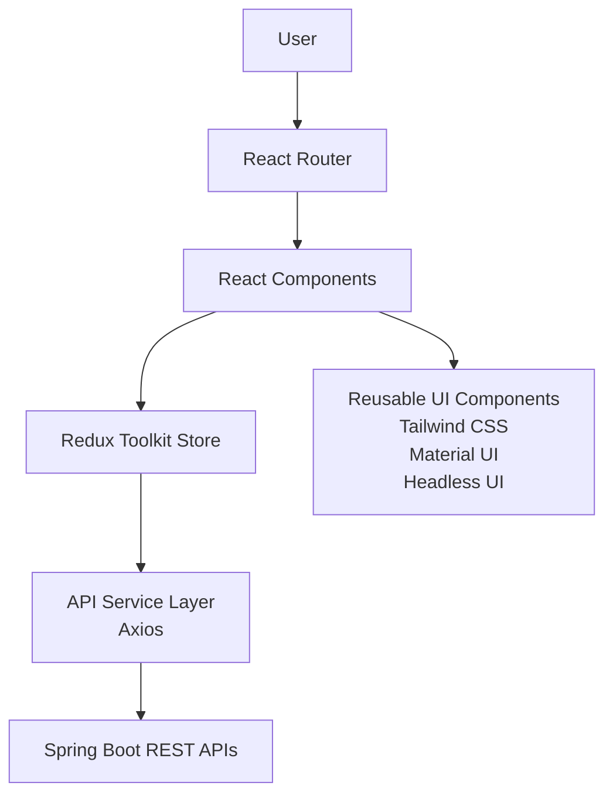

### Application Components

| Component | Responsibility |
|-----------|----------------|
| **React Router** | Handles client-side navigation between public pages, authenticated pages, and role-based dashboards while protecting routes based on authentication and user roles. |
| **React Components** | Implement the application's user interface using reusable, feature-focused components responsible for rendering data and handling user interactions. |
| **Redux Toolkit Store** | Centralizes application state for authentication, shopping cart, products, orders, and other shared data, providing predictable state updates across the application. |
| **API Service Layer** | Uses Axios to communicate with the Spring Boot backend, encapsulating HTTP requests and responses from the application's React components. |
| **Reusable UI Components** | Provides reusable layouts, navigation, forms, dialogs, tables, and other interface elements built with Tailwind CSS, Material UI, and Headless UI to maintain a consistent user experience. |
| **Spring Boot Backend** | Exposes the REST APIs consumed by the frontend for authentication, product management, shopping cart operations, order processing, payments, and administrative features. |

## Project Structure

The project is organized using a feature-oriented structure where related components, Redux state, API communication, reusable hooks, and utility modules are grouped into dedicated directories. This organization keeps presentation logic, application state, and shared functionality separated, making the codebase easier to navigate and maintain.

The following structure highlights the primary directories and entry points of the application.

```text
src
├── api/                 # Axios configuration and API communication
├── assets/              # Static images and other frontend assets
├── components/
│   ├── admin/           # Administrator dashboard components
│   ├── auth/            # Login and registration
│   ├── cart/            # Shopping cart
│   ├── checkout/        # Checkout and payment
│   ├── home/            # Landing page
│   ├── products/        # Product catalog
│   ├── shared/          # Reusable UI components
│   ├── user/            # Customer dashboard
│   ├── About.jsx
│   ├── Contact.jsx
│   ├── PrivateRoute.jsx
│   └── UserMenu.jsx
├── hooks/               # Custom React hooks
├── store/
│   ├── actions/         # Redux actions
│   ├── reducers/        # Redux reducers
│   └── store.js         # Redux store configuration
├── utils/               # Shared utility functions
├── App.jsx
├── main.jsx
└── index.css
```

### Directory Organization

| Directory | Description |
|-----------|-------------|
| **api** | Axios configuration and modules responsible for communicating with the Spring Boot backend REST APIs. |
| **assets** | Static assets including images used throughout the application. |
| **components** | Feature-based React components organized by application modules such as authentication, products, cart, checkout, customer pages, seller functionality, administrator dashboard, and reusable shared components. |
| **hooks** | Custom React hooks that encapsulate reusable filtering logic and other shared application behavior. |
| **store** | Redux store configuration together with application actions and reducers responsible for centralized state management. |
| **utils** | Shared utility functions and application constants used across multiple features. |
| **App.jsx** | Root application component responsible for configuring the application's routing and top-level layout. |
| **main.jsx** | Frontend entry point that initializes React, Redux, routing, and mounts the application. |
| **index.css** | Global application styles and Tailwind CSS imports. |

## Routing

The application uses React Router to provide client-side navigation between public pages, authenticated user pages, seller functionality, and administrator dashboards. Routes are organized to separate customer-facing pages from role-specific management interfaces while maintaining a consistent navigation experience throughout the application.

Access to protected pages is enforced through a dedicated `PrivateRoute` component. Before rendering protected content, the application verifies the user's authentication status and assigned role, ensuring that only authorized users can access seller and administrator functionality.

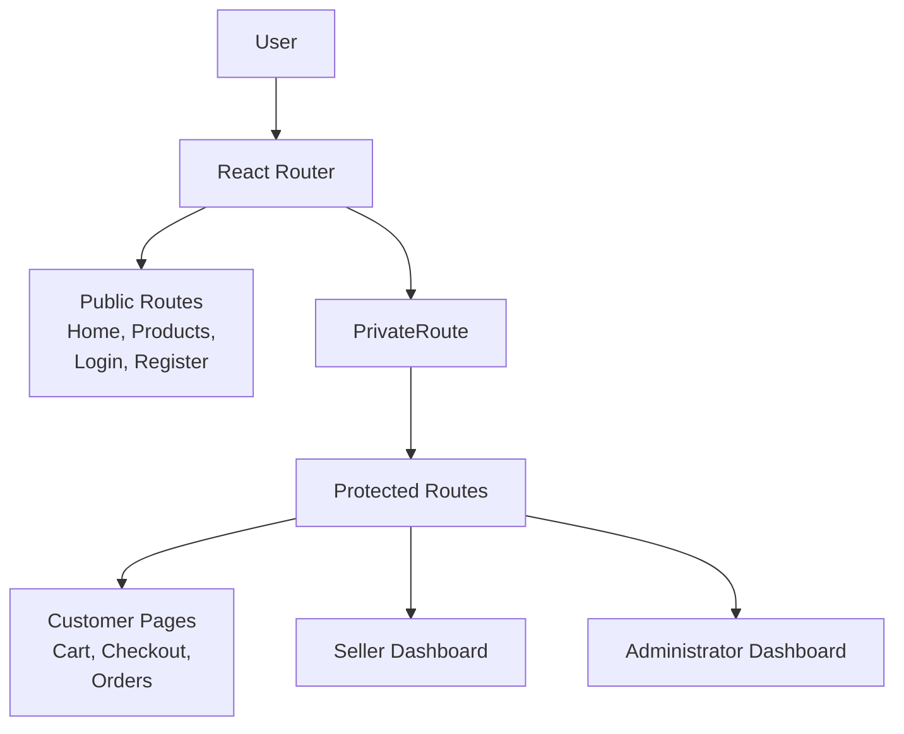

### Routing Components

| Component | Responsibility |
|-----------|----------------|
| **React Router** | Maps URL paths to the corresponding React pages and components while enabling client-side navigation without full page reloads. |
| **Public Routes** | Provide access to pages such as the home page, product catalog, login, registration, and other content available without authentication. |
| **PrivateRoute** | Protects authenticated routes by validating the user's authentication state and role before rendering the requested page. |
| **Customer Pages** | Contain authenticated functionality such as shopping cart management, checkout, payment, and order history. |
| **Seller Dashboard** | Provides seller-specific pages for managing products and viewing customer orders associated with the seller's inventory. |
| **Administrator Dashboard** | Provides administrative pages for managing products, categories, sellers, customer orders, and other platform administration features. |

## State Management (Redux)

The application uses Redux Toolkit to centralize state that is shared across multiple pages and components. Rather than passing data through multiple levels of the component hierarchy, shared application state is stored in a single Redux store, allowing different parts of the application to access and update data consistently.

React components dispatch Redux actions in response to user interactions such as authentication, product browsing, shopping cart updates, and order management. Reducers update the application state, after which React automatically re-renders the affected components with the latest data.

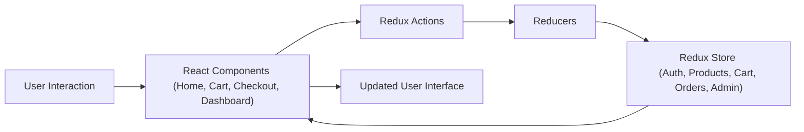

### Redux Components

| Component | Responsibility |
|-----------|----------------|
| **React Components** | Dispatch Redux actions in response to user interactions and render data obtained from the Redux store. |
| **Redux Actions** | Represent application events such as user authentication, product retrieval, shopping cart updates, order management, and administrative operations. |
| **Reducers** | Update the centralized application state based on dispatched actions while maintaining predictable state transitions. |
| **Redux Store** | Maintains shared application state including authentication, products, shopping cart, orders, seller management, administrator data, payment method selection, and application errors. |

## Authentication & Authorization

The frontend implements authentication using the JWT-based REST APIs exposed by the Spring Boot backend. Users can register or log in through dedicated authentication pages. After a successful login, the backend returns the authenticated user's information together with a short-lived access JWT and a long-lived refresh token. The frontend stores this authentication information in the centralized Redux store and persists it in `localStorage`, allowing the user's authenticated session to be restored after a page refresh.

The access JWT is attached to authenticated API requests through an Axios request interceptor. Since the access JWT is short-lived, the frontend automatically handles `401 Unauthorized` responses by using the stored refresh token to request a new access JWT. The backend rotates the refresh token during this process, returning a new access JWT and refresh token. The frontend updates its stored authentication information and retries the original request, allowing the user to remain logged in without manually signing in again.

Access to protected pages is enforced through the `PrivateRoute` component. Before rendering protected content, the application verifies the authenticated user stored in Redux and checks the assigned roles. Unauthenticated users are redirected to the login page, authenticated users are prevented from accessing public authentication pages, and role-based restrictions are applied to seller and administrator routes.

When the user logs out, the frontend sends the current refresh token to the backend signout endpoint. The backend revokes the refresh token, preventing it from being used to obtain new access tokens. The frontend then clears the authentication state, shopping cart, checkout information, and other session-related data before redirecting the user to the login page.

### Token Lifecycle

The frontend uses a short-lived access JWT together with a longer-lived refresh token to maintain authenticated sessions.

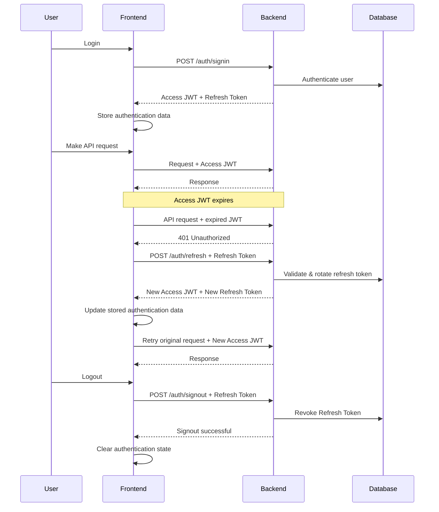

The access JWT is used for normal API authentication, while the refresh token is used only to obtain a new access JWT after expiration.

Refresh tokens are rotated whenever they are used. The previously used refresh token is revoked and a new refresh token is issued. This prevents a previously used refresh token from being reused after successful rotation.

### Authentication Components

| Component | Responsibility |
|-----------|----------------|
| **Login & Registration Pages** | Collect user credentials and submit authentication requests to the Spring Boot backend. |
| **Spring Boot Authentication API** | Authenticates users, generates access JWTs and refresh tokens, and returns the authenticated user's information. |
| **Axios Request Interceptor** | Attaches the current access JWT to authenticated API requests. |
| **Axios Response Interceptor** | Handles `401 Unauthorized` responses by requesting new tokens using the refresh token, updating the stored authentication data, and retrying the failed request. |
| **localStorage** | Persists the authenticated user's information, including the access JWT and refresh token, allowing the session to be restored after a page refresh. |
| **Redux Store** | Maintains the authenticated user's information, assigned roles, checkout state, Stripe client secret, and other session-related application data. |
| **PrivateRoute** | Protects authenticated routes, redirects unauthenticated users to the login page, prevents authenticated users from revisiting authentication pages, and enforces role-based access restrictions. |
| **Protected Pages** | Authenticated pages such as checkout, order history, and role-specific seller and administrator dashboards that require successful authentication and authorization. |
| **Logout Action** | Sends the refresh token to the backend for revocation and then clears the frontend authentication and session state. |

### Role Permissions

| Role | Frontend Access |
|------|-----------------|
| **Customer** | Browse products, manage the shopping cart, complete checkout, and view personal order history. |
| **Seller** | Access seller dashboard features for managing products and viewing seller orders associated with their products. |
| **Administrator** | Access the complete administrative dashboard, including product, category, seller, and order management. |


## Application Flow

The following workflow illustrates the typical user journey through the frontend application, beginning with product discovery and continuing through authentication, shopping, checkout, payment, and order completion. The flow reflects how the frontend coordinates routing, authentication, state management, and backend communication to deliver a complete e-commerce experience.

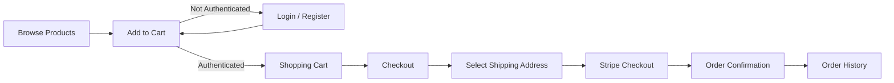

### Workflow Stages

| Stage | Description |
|------|-------------|
| **Browse Products** | Users can browse the product catalog, search products, apply filters, and view product details without signing in. |
| **Login / Register** | Authentication is required before products can be added to the shopping cart. New users can register while existing users authenticate using the backend's JWT-based authentication APIs. |
| **Add to Cart** | Authenticated users can add products to their shopping cart. Unauthenticated users attempting this action are redirected to the login page. |
| **Shopping Cart** | Authenticated users review selected products, update quantities, remove items, and proceed to checkout. |
| **Checkout** | The frontend prepares the order for payment by collecting the required checkout information before redirecting the user to Stripe Checkout. |
| **Select Shipping Address** | Users select or create a shipping address that will be associated with the order. |
| **Stripe Checkout** | The frontend redirects the user through the Stripe Checkout payment flow before completing the purchase. |
| **Order Confirmation** | After successful payment, the frontend displays the payment confirmation and order completion page. |
| **Order History** | Authenticated users can review previously placed orders from their account dashboard. |

## Backend Integration

The frontend communicates with the Ecommerce Backend through RESTful APIs exposed by the Spring Boot application. HTTP communication is centralized using an Axios-based API module, allowing React components and Redux actions to interact with backend services without directly managing network requests.

User interactions such as authentication, product browsing, shopping cart updates, checkout, order management, and administrative operations trigger API requests to the backend. Responses are processed by Redux actions and dispatched to the Redux store, allowing React components to automatically render the updated application state. For authenticated operations, the frontend includes the user's JWT with each protected request, allowing the backend to enforce role-based authorization.

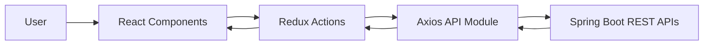

### Integration Components

| Component | Responsibility |
|-----------|----------------|
| **React Components** | Initiate backend operations in response to user interactions such as authentication, product browsing, shopping cart management, checkout, and administrative tasks. |
| **Redux Actions** | Coordinate asynchronous API requests, process backend responses, dispatch state updates, and handle success or failure scenarios. |
| **Axios API Module** | Centralizes HTTP communication with the Spring Boot backend, providing a reusable interface for sending authenticated and unauthenticated REST API requests. |
| **Spring Boot REST APIs** | Expose backend endpoints for authentication, products, categories, shopping cart, checkout, payments, orders, seller management, and administrator functionality. |

## Stripe Integration

The frontend integrates with **Stripe** using the **Payment Intents API** together with **Stripe Elements** to provide secure online payment processing. During checkout, the application requests a Stripe Client Secret from the Spring Boot backend, which is then used to initialize Stripe Elements and securely collect the customer's payment details.

After Stripe successfully confirms the payment, the user is redirected back to the application. The frontend then submits the Stripe Payment Intent ID together with the selected shipping address to the backend, where the payment is validated, the order is created, inventory is updated, and the completed order is returned.

### Payment Flow

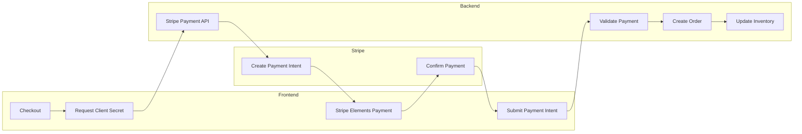

### Frontend Responsibilities

| Responsibility | Description |
|----------------|-------------|
| **Request Client Secret** | Sends the checkout information to the backend to create a Stripe Payment Intent and retrieve its Client Secret. |
| **Initialize Stripe Elements** | Uses the Client Secret to initialize Stripe Elements and securely render the `PaymentElement` payment form. |
| **Collect Payment Details** | Allows customers to securely enter their payment information through Stripe-hosted UI components without exposing sensitive card data to the application. |
| **Confirm Payment** | Uses Stripe.js to confirm the payment and redirects the user back to the application's payment confirmation page. |
| **Submit Payment Intent** | After successful payment, submits the Stripe Payment Intent ID together with the selected shipping address to the backend so the order can be created. |
| **Display Order Confirmation** | Displays the payment confirmation page after successful order creation, refreshes the shopping cart, and clears temporary checkout state. |

### Security Considerations

- The frontend never directly processes or stores raw card information.
- Payment details are securely collected through **Stripe Elements** (`PaymentElement`).
- Only the Stripe Client Secret is received from the backend; Stripe Secret Keys remain exclusively on the backend.
- The Payment Intent ID is submitted to the backend only after Stripe successfully confirms the payment.
- Checkout-related state, including the Client Secret and selected shipping address, is cleared after successful order placement.

## UI Components

The user interface is built using reusable React components organized by application features. Rather than placing all components in a single directory, the project groups related functionality into dedicated modules such as authentication, products, shopping cart, checkout, customer pages, seller functionality, and administrator dashboards. Shared UI components are separated into their own module so they can be reused consistently throughout the application.

This feature-oriented organization improves maintainability, promotes component reuse, and keeps presentation logic isolated from state management and backend communication.

### Component Categories

| Component Group | Description |
|-----------------|-------------|
| **Authentication** | Login, registration, route protection, and user authentication components. |
| **Home & Products** | Landing page, product catalog, filtering, product cards, and product browsing experience. |
| **Cart** | Shopping cart management, quantity updates, and cart item presentation. |
| **Checkout** | Shipping address management, payment method selection, Stripe integration, and order confirmation. |
| **Customer Pages** | Authenticated customer functionality such as viewing previous orders and managing account-related pages. |
| **Administrator Dashboard** | Administrative interfaces for managing products, categories, sellers, customer orders, and dashboard analytics. |
| **Shared Components** | Reusable UI elements including navigation, forms, dialogs, tables, loaders, pagination, modals, product cards, sidebars, and other common interface components shared across the application. |

## Installation

Follow the steps below to install the required software and obtain a local copy of the project.

### Prerequisites

Ensure the following software is installed before proceeding.

| Software | Version |
|----------|----------|
| Node.js | 22 LTS (or later) |
| npm | 10+ |
| Git | Latest stable version |

> **Note:** This project was developed and tested using Node.js 22 LTS.

### Clone the Repository

```bash
git clone https://github.com/Dhanno98/Ecommerce-Frontend.git
cd Ecommerce-Frontend
```

---

### Install Dependencies

Install all required project dependencies.

```bash
npm install
```

---

## Configuration

### Configure Environment Variables

The application reads environment-specific configuration such as the backend API URL and Stripe Publishable Key from environment variables instead of hardcoding them into the source code.

Copy the provided `.env.example` file.

```bash
cp .env.example .env
```

The repository includes a `.env.example` file documenting all required variables. Update the values according to your local environment.

Example:

```text
VITE_API_BASE_URL=http://localhost:8080
VITE_FRONTEND_URL=http://localhost:5173
VITE_STRIPE_PUBLISHABLE_KEY=pk_test_xxxxxxxxxxxxxxxxx
```

> **Important**
>
> The Stripe Publishable Key is intended for client-side use and is safe to expose. Never place your Stripe Secret Key in the frontend application.

> **Note**
>
> Ensure the Ecommerce Backend application is running before starting the frontend, as all API requests depend on the backend services.

---

## Running the Application

### Start the Development Server

Start the Vite development server.

```bash
npm run dev
```

By default, the application will be available at:

```text
http://localhost:5173
```

---

### Build for Production

Generate an optimized production build.

```bash
npm run build
```

The production-ready files will be generated inside the `dist` directory.

---

### Preview the Production Build

Serve the production build locally.

```bash
npm run preview
```

---

### Verify the Installation

Once both the frontend and backend applications are running successfully, you should be able to:

- Open the frontend application in your browser.
- Browse products and categories.
- Register a new account or log in.
- Add products to the shopping cart.
- Complete the checkout process.
- Access seller and administrator dashboards based on your assigned role.

If these features are functioning correctly, the frontend has been configured successfully.

## Screenshots

The following screenshots showcase the primary user interfaces of the application, highlighting the customer shopping experience together with the seller and administrator dashboards.

<table>
  <tr>
    <td align="center">
      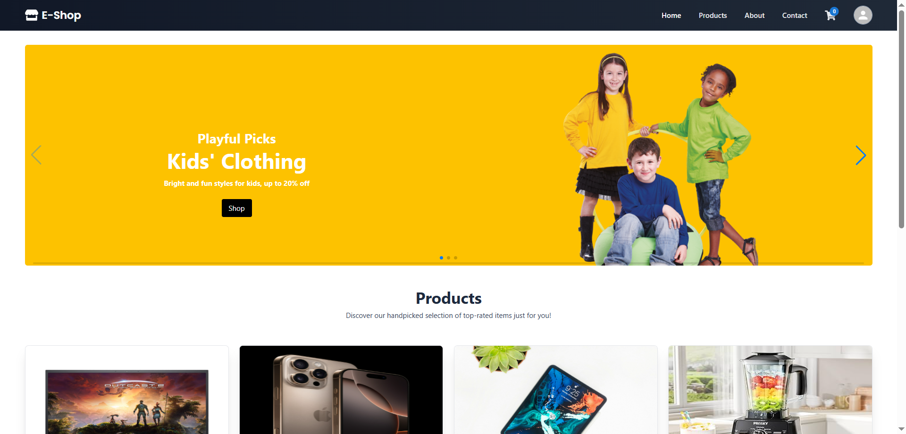<br>
      <b>Home Page</b>
    </td>
    <td align="center">
      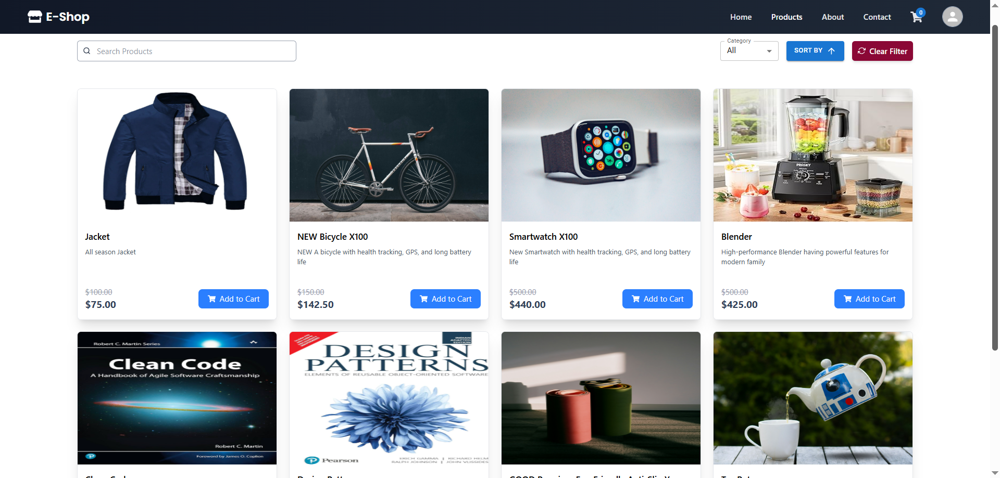<br>
      <b>Product Catalog</b>
    </td>
  </tr>

  <tr>
    <td align="center">
      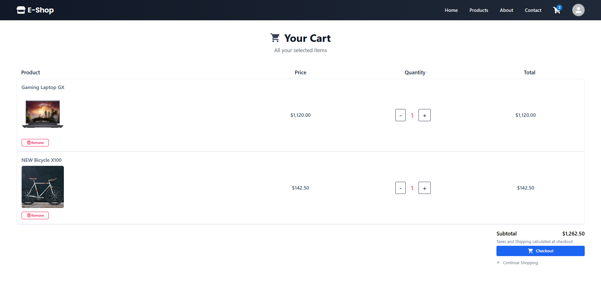<br>
      <b>Shopping Cart</b>
    </td>
    <td align="center">
      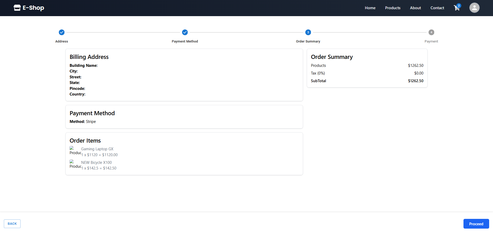<br>
      <b>Checkout</b>
    </td>
  </tr>

  <tr>
    <td align="center">
      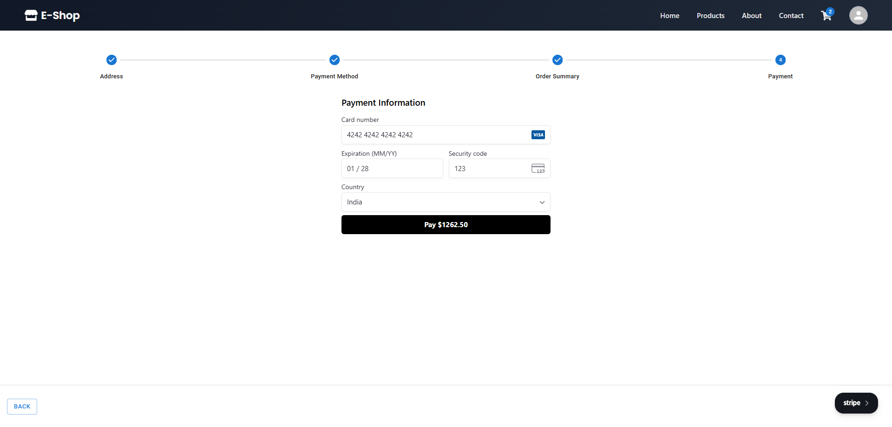<br>
      <b>Stripe Payment</b>
    </td>
    <td align="center">
      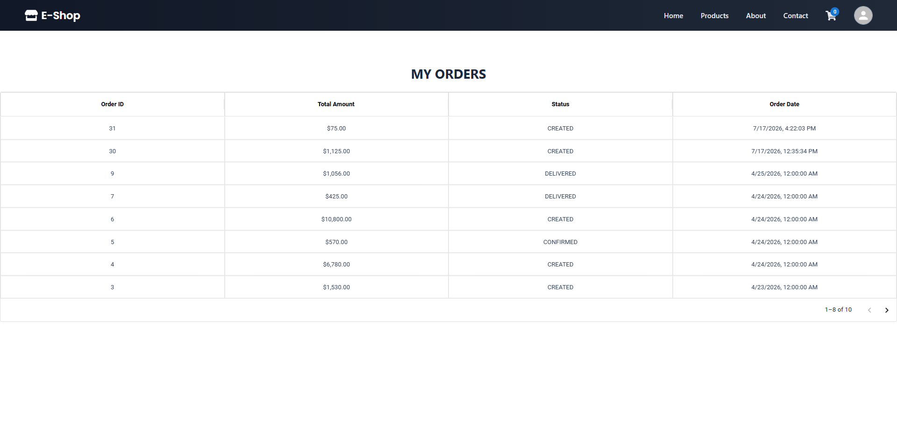<br>
      <b>Order History</b>
    </td>
  </tr>

  <tr>
    <td align="center">
      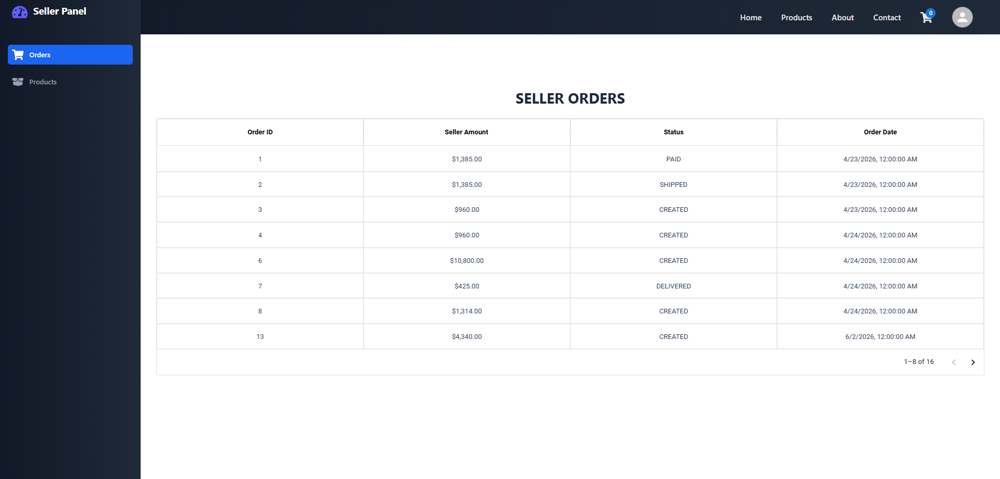<br>
      <b>Seller Dashboard</b>
    </td>
    <td align="center">
      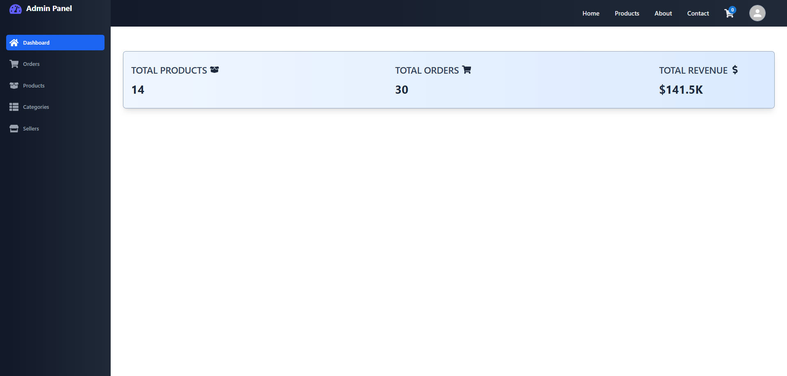<br>
      <b>Admin Dashboard</b>
    </td>
  </tr>
</table>

## Contributing

Contributions, suggestions, and bug reports are welcome.

If you would like to contribute to this project:

1. Fork the repository.
2. Create a feature branch.
3. Implement your changes following the existing project structure and coding conventions.
4. Verify that the application builds successfully and that your changes function as expected.
5. Submit a Pull Request with a clear description of the changes.

Please ensure that new code follows the existing coding style, maintains consistency with the existing architecture, and preserves the overall quality of the project.

For significant feature additions or architectural changes, consider opening an issue first to discuss the proposed approach.

## License

This project is licensed under the MIT License. See the [LICENSE](LICENSE) file for details.

## Acknowledgements

This project builds upon several excellent open-source technologies, libraries, and services.

Special thanks to their maintainers and contributors.

- React
- Vite
- Redux Toolkit
- React Router
- Tailwind CSS
- Material UI
- Axios
- Stripe
- React Hot Toast
- Spring Boot (Backend API)

Their tools, documentation, and community support made the development of this project possible.